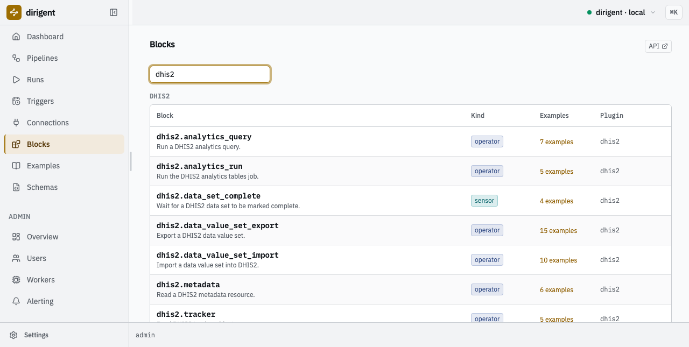
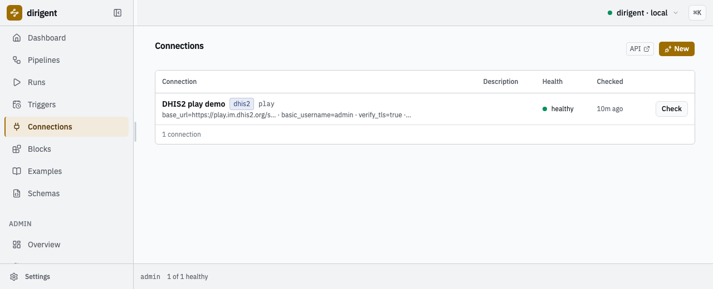
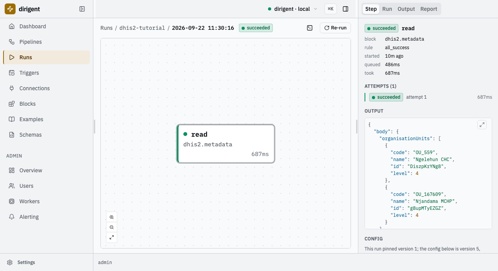
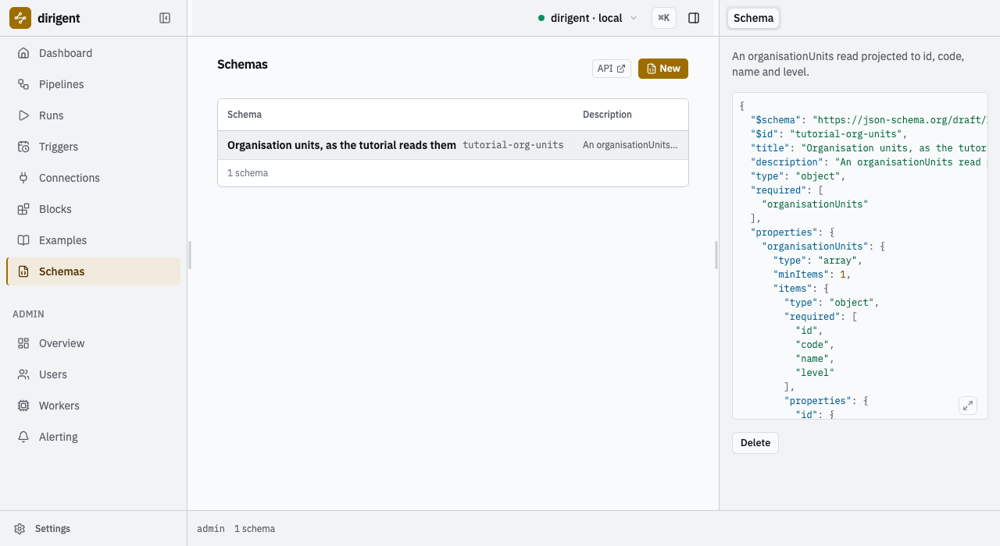
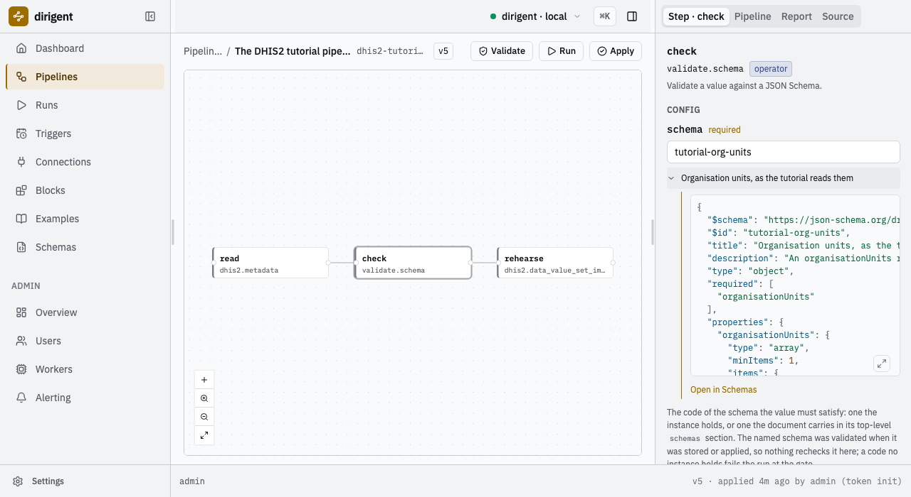
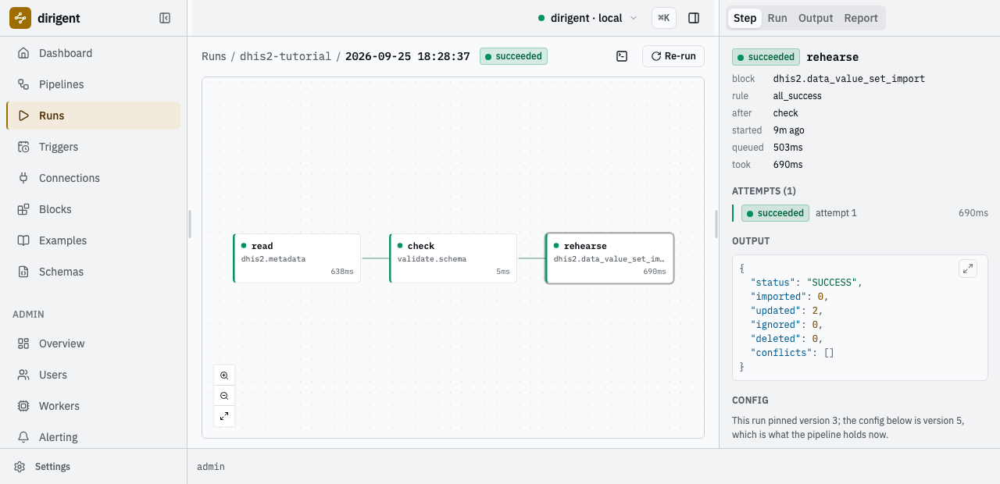
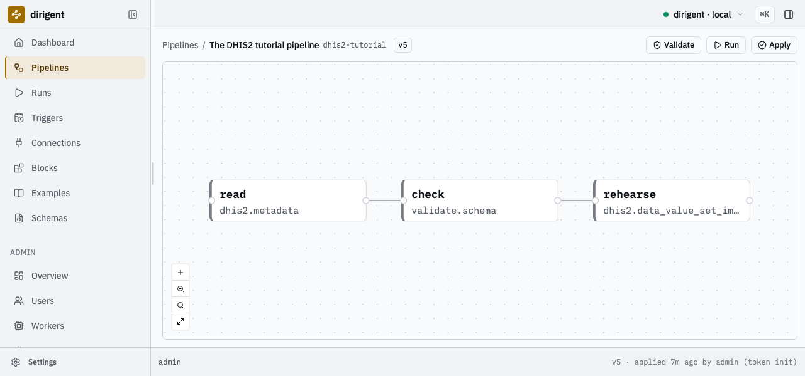
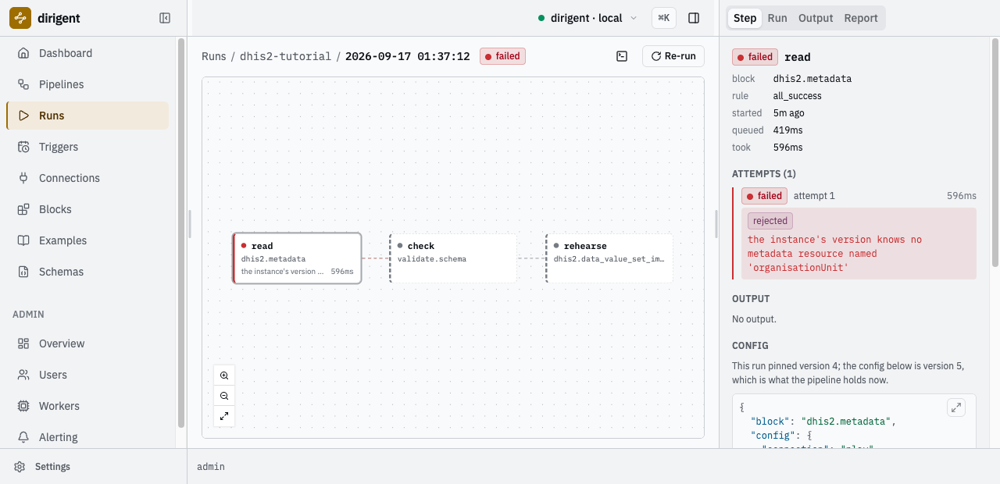
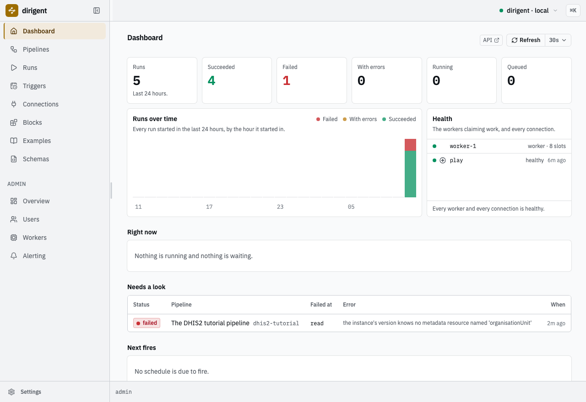
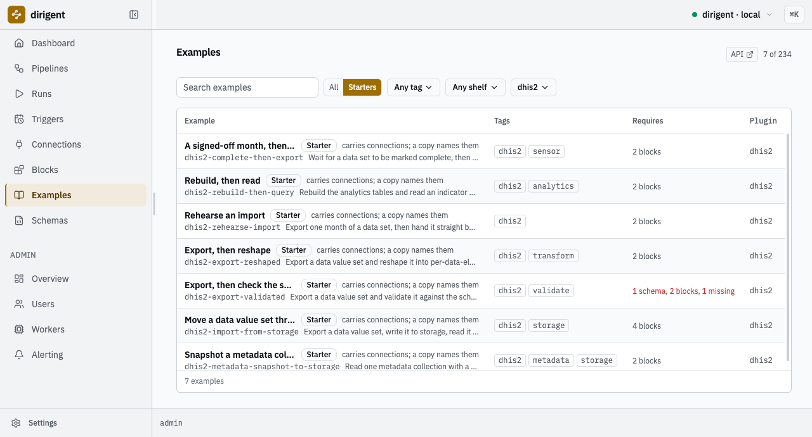

# Tutorial

Three moves against a real DHIS2 instance: **one read**, **a schema gate on the answer**, and
**a write built from the validated value** -- with a deliberate failure and a retry in between.
At the end you have a project on your machine, an instance serving a UI, a `dhis2` connection,
and a pipeline that reads the play demo, refuses an answer that has moved, and rehearses an
import at the organisation unit the answer named.

!!! info "Do the first half first"

    This is the second half of a two-part course.
    [**The basics**](https://winterop-com.github.io/dirigent/basics/), in dirigent's own
    documentation, makes the same three moves against Postman Echo: one HTTP request, a JSON
    Schema gate on the answer, and a send built from the validated value. Everything here is
    that page's shape with DHIS2 in the middle, so do it first and you will recognise every
    step. This page assumes nothing else.

    A printable copy of this page:
    [**tutorial.pdf**](https://winterop-com.github.io/dirigent-dhis2/tutorial.pdf).

Everything below was run against the public DHIS2 demo,
`https://play.im.dhis2.org/stable-2-43-1`, version **2.43.1** -- the Sierra Leone database, with
the published `admin` / `district` credential. That instance is shared and it resets itself, so
nothing here writes to it: the one import is a rehearsal, and DHIS2 tells you exactly what it
would have done.

What you need: Python 3.13, [uv](https://docs.astral.sh/uv/), `jq`, and two terminals.
Every command below is run in the project directory.

## Where these documents live

The pack keeps its documents on [shelves](examples.md) and its tests hold every one of them to
the pack's catalog. The tutorial's documents are not on a shelf: one of them is wrong on
purpose, and a shelf that carries a broken document is a corpus you cannot trust. So they live
here, in full, and you write them into your own project as you go.

## 1. A project, an instance, and the pack

`dg init` writes a uv project and the instance the project addresses. `--pack` adds this pack
to the project's dependencies, which is the whole of installing it:

```bash
uv tool install dirigent-cli
dg init dhis2-tutorial --template local --pack dirigent-dhis2 --password "the one you will use"
cd dhis2-tutorial
uv sync
```

```text
2026-09-20T00:52:52.672+02:00 [info    ] initialised                    [instance.initialised] directory=/home/you/dhis2-tutorial state=.dirigent/state schema=0001_baseline admin=admin template=local version=0.16.7 packs=["dirigent-dhis2"]
```

It creates the state directory, migrates the schema, creates the first admin, and mints that
admin one token -- shown once, and written to the project's `.env`, where the `local` profile
reads it. Nothing has to be pasted anywhere. `uv sync` then builds the project's environment
from the `pyproject.toml` it wrote, so every `uv run dg` below is the runtime this project
pins, with the pack in it.

The last lines it prints are about the other thing it wrote into that `.env`:

```text
DIRIGENT_SECRET_KEY is in .env beside it, and every command run in
this directory reads it: it is what connection secrets are sealed with, and
under another key the instance cannot open what it stored.
```

The connection in the next section carries a DHIS2 password, and a connection secret is sealed
at rest with that key. A project's `.env` is a settings layer, so the key is in force for every
command run in this directory, `dg dev` included, and there is nothing to export. Keep the
file: a secret is sealed under the key that was set when it was stored, and an instance running
under a different key finds a connection it cannot read.

Start the instance in a second terminal, in this directory:

```bash
uv run dg dev
```

`dg dev` is one process holding the API, the web UI, the scheduler, one worker and a SQLite
file under `.dirigent/state/`. It keeps running; leave it. The UI is at
`http://127.0.0.1:3333`, and `admin` logs in there with the password you just gave.

Back in the first terminal, the pack is in the catalog because it is installed -- there is no
registration step and no config file:

```bash
uv run dg blocks list
```

```text
┏━━━━━━━━━━━━━━━━━━━━━━━━━━━━━┳━━━━━━━━━━┳━━━━━━━━━┳━━━━━━━━━━━━━━━━━━━━━━━━━━━━━━━━━━━┓
┃ id                          ┃ kind     ┃ plugin  ┃ summary                           ┃
┡━━━━━━━━━━━━━━━━━━━━━━━━━━━━━╇━━━━━━━━━━╇━━━━━━━━━╇━━━━━━━━━━━━━━━━━━━━━━━━━━━━━━━━━━━┩
│ dhis2.analytics_query       │ operator │ dhis2   │ Run a DHIS2 analytics query.      │
│ dhis2.analytics_run         │ operator │ dhis2   │ Run the DHIS2 analytics tables    │
│                             │          │         │ job.                              │
│ dhis2.data_set_complete     │ sensor   │ dhis2   │ Wait for a DHIS2 data set to be   │
│                             │          │         │ marked complete.                  │
│ dhis2.data_value_set_export │ operator │ dhis2   │ Export a DHIS2 data value set.    │
│ dhis2.data_value_set_import │ operator │ dhis2   │ Import a data value set into      │
│                             │          │         │ DHIS2.                            │
│ dhis2.metadata              │ operator │ dhis2   │ Read a DHIS2 metadata resource.   │
│ dhis2.tracker               │ operator │ dhis2   │ Read DHIS2 tracker objects.       │
└─────────────────────────────┴──────────┴─────────┴───────────────────────────────────┘
storage schemes: -   connection kinds: dhis2, docker, email, git, http, kafka, rabbitmq,
slack, sql, webhook
```

Seven blocks in the `dhis2` group, and `dhis2` among the connection kinds. The same catalog is
the Blocks screen in the UI, where each block says how many of the pack's example documents use
it:



*The seven blocks the pack contributes, as the instance's own catalog reports them.*

## 2. The connection

One `dhis2` connection is one instance and the credential to reach it. Create it exactly as
[the connection reference](connection.md) shows:

```bash
uv run dg connection create dhis2 play \
  --name "DHIS2 play demo" \
  --set base_url=https://play.im.dhis2.org/stable-2-43-1 \
  --set basic_username=admin \
  --set basic_password=district
```

```text
2026-09-17T02:09:08.356+02:00 [info    ] created                        [connection.created] code=play connection_kind=dhis2 name="DHIS2 play demo" config={"base_url":"https://play.im.dhis2.org/stable-2-43-1","api_token":null,"basic_username":"admin","verify_tls":true,"timeout":"30s","basic_password":"***"}
```

The password is already withheld in the record the command answers with, and in every read
after it.

Name the versioned host, not `https://play.dhis2.org/demo`. That alias redirects across hosts,
and a client that follows it drops the credential when the origin changes; resolve it once with
`curl -sSI https://play.dhis2.org/demo` and name what it resolves to.

Now check it:

```bash
uv run dg connection check play
```

```text
2026-09-17T02:13:24.567+02:00 [info    ] healthy                        [connection.checked] code=play healthy=true version=2.43.1
```

That one line is four facts: the URL resolves, TLS is as configured, the credential is
accepted, and the instance's version is **2.43.1** -- its own word for itself, read from
`/api/system/info` rather than guessed from an `/api/N` path.



*The connection on the Connections screen. The config summary is on the row; the password is not.*

**What the kind buys you.** The same instance is reachable with an ordinary `http` connection
and `http.request` steps -- that is what the [`dhis2-http` shelf](examples.md#the-generic-http-way)
does, and it is the right answer for a call no block covers yet. A `dhis2` connection is worth
more than a base URL and a header because it carries four things a raw HTTP step cannot:

- **the version**, resolved when the client is built, so `dhis2.metadata` refuses a collection
  name this instance does not publish instead of sending a request that will 404;
- **one credential, checked** -- a token or a username and password, never both, and never
  neither, refused when the connection is written rather than when a step first runs;
- **the format checkers** `dhis2-uid`, `dhis2-period` and `dhis2-code`, which any schema on this
  instance may now assert with (section 4);
- **a failure classification** that means the same thing in every block of the pack (section 6).

## 3. The first request

The smallest useful read: the organisation units directly under one chiefdom. Write
`pipelines/dhis2-tutorial.yaml`:

```yaml
# Read the organisation units under one chiefdom of the DHIS2 play demo.
#
# dhis2.metadata reads a metadata collection through the accessor the instance's own version
# publishes, so resource is the collection name exactly as it appears in the API path.
# fields is the DHIS2 projection: it decides what comes back, and what it does not name does
# not arrive. filter is DHIS2's own syntax -- a property path, an operator, a value.

format: dirigent/v1
kind: pipeline
code: dhis2-tutorial
name: The DHIS2 tutorial pipeline
description: Read the organisation units directly beneath one unit, with their codes and levels.

tags: [dhis2, tutorial]

requires:
  blocks:
    - dhis2.metadata
  connections:
    - play

params:
  type: object
  properties:
    parent:
      type: string
      # A format the pack contributes. A run submitted with something that is not a DHIS2
      # uid is refused here, before a call is made.
      format: dhis2-uid
      default: YuQRtpLP10I
      description: The uid of the parent whose children are read. Badjia chiefdom by default.

steps:
  read:
    block: dhis2.metadata
    config:
      connection: play
      resource: organisationUnits
      fields: id,code,name,level
      filter: "parent.id:eq:${params.parent}"
      order: [name:asc]
```

`requires` is the document saying what it needs of an instance: the block ids and the
connection code. An instance missing one of them refuses the document rather than failing
halfway through a run.

Check it offline first -- no server, no DHIS2, no network:

```bash
uv run dg validate pipelines/dhis2-tutorial.yaml
```

```text
2026-09-17T01:34:17.045+02:00 [info    ] valid                          [validation] code=dhis2-tutorial document=pipelines/dhis2-tutorial.yaml checked="document, offline"
  each step under the last one it waits for
    read  (dhis2.metadata)
2026-09-17T01:34:17.047+02:00 [info    ] valid                          [validated] documents=1 invalid=0
```

Then store it on the instance and run it:

```bash
uv run dg apply
uv run dg run dhis2-tutorial --watch
```

```text
create dhis2-tutorial  version 1 (/home/you/dhis2-tutorial/pipelines/dhis2-tutorial.yaml)
```

`dg apply` sends every document in the project and stores each as an immutable version;
applying an unchanged document again is not a new version. `dg run --watch` streams the step
transitions and settles with the run:

```text
run 01a0ac92-38dc-737a-8ab2-ffa099350a63
pipeline      dhis2-tutorial (version 1)
status        succeeded
triggered by  admin (token init)
duration      0.7s
items         -

steps
┏━━━━━━┳━━━━━━━━━━━━━━━━┳━━━━━━━━━━━┳━━━━━━━┳━━━━━━━━━━┳━━━━━━━━━━┳━━━━━━━┓
┃ step ┃ block          ┃ outcome   ┃ after ┃ attempts ┃ duration ┃ error ┃
┡━━━━━━╇━━━━━━━━━━━━━━━━╇━━━━━━━━━━━╇━━━━━━━╇━━━━━━━━━━╇━━━━━━━━━━╇━━━━━━━┩
│ read │ dhis2.metadata │ succeeded │ -     │ 1        │ 0.7s     │ -     │
└──────┴────────────────┴───────────┴───────┴──────────┴──────────┴───────┘

outputs
┏━━━━━━┳━━━━━━━━━━━━━━━━━━━━━━━━━━━━━━━━┓
┃ step ┃ output                         ┃
┡━━━━━━╇━━━━━━━━━━━━━━━━━━━━━━━━━━━━━━━━┩
│ read │ body={1 keys}  duration_ms=654 │
└──────┴────────────────────────────────┘
```

The answer itself is in the run, not on the screen. Every command writes records when its
output is not a terminal, so the whole answer is one `jq` away:

```bash
uv run dg runs show 01a0ac92-38dc-737a-8ab2-ffa099350a63 --json \
  | jq '.fields.attempts[] | select(.step_name == "read") | .output.body'
```

```json
{
  "organisationUnits": [
    {
      "code": "OU_559",
      "name": "Ngelehun CHC",
      "id": "DiszpKrYNg8",
      "level": 4
    },
    {
      "code": "OU_167609",
      "name": "Njandama MCHP",
      "id": "g8upMTyEZGZ",
      "level": 4
    }
  ]
}
```

Two facilities, each with the four fields `fields=` asked for. The same run is on the Runs
screen of the UI, and choosing a step opens what it produced:



*The run's only step, and the answer it stored, on the Runs screen.*

## 4. The gate

A metadata read is a contract with a system you do not control. Write the contract down, and a
payload that has moved stops at the step it arrived in rather than turning into something
strange three steps later.

A schema is a document section, keyed by code, exactly the way connections are. Add it, and a
`validate.schema` step that names it:

```yaml
schemas:
  tutorial-org-units:
    title: Organisation units, as this pipeline reads them
    type: object
    required: [organisationUnits]
    properties:
      organisationUnits:
        type: array
        minItems: 1
        items:
          type: object
          required: [id, code, name, level]
          properties:
            id: { type: string, format: dhis2-uid }
            code: { type: string, format: dhis2-code }
            name: { type: string }
            level: { type: integer, minimum: 1 }

steps:
  # ... read, unchanged ...

  check:
    block: validate.schema
    depends_on: [read]
    config:
      input: ${steps.read.output.body}
      schema: tutorial-org-units
```

`format: dhis2-uid` and `format: dhis2-code` are this pack's, and they assert because the pack
is installed. In JSON Schema a `format` annotates and nothing more; dirigent always hands its
validator a checker, and every installed pack's formats join it. A `dhis2-uid` is a letter and
ten alphanumerics; a `dhis2-code` is DHIS2's own `code` property, one to fifty characters, not
padded, on one line -- `OU_559` is one. The third,
[`dhis2-period`](formats.md#dhis2-period), turns up in the next section.

Now apply it:

```bash
uv run dg apply
```

```text
2026-09-17T01:35:44.082+02:00 [error   ] this document carries its own schemas (tutorial-org-units), which an instance will not store: create them with `dg schema create` and let the document name them in requires.schemas [error] status=422 title="Unprocessable Content" instance=/api/v1/pipelines/$apply
```

That refusal is the rule worth learning early: **a server stores no schema a document carries**,
exactly as it stores no connection a document carries. A schema is a thing the instance holds
and a document names, so that two pipelines gating on the same shape are gating on the same
shape.

A carried schema is still worth having, because a local run seeds what the document brought,
and a local run is the fast loop. Give it the connection it has nowhere else to read --
`tutorial-connections.yaml`:

```yaml
# The connections a --local run has nowhere else to read. This credential is the play demo's
# own, published so that anyone may try the instance; a real instance's credential belongs in
# a connection on the server and never in a file beside the documents.

connections:
  play:
    kind: dhis2
    config:
      base_url: https://play.im.dhis2.org/stable-2-43-1
      basic_username: admin
      basic_password: district
```

```bash
uv run dg run --local pipelines/dhis2-tutorial.yaml --connections tutorial-connections.yaml
```

```text
steps
┏━━━━━━━┳━━━━━━━━━━━━━━━━━┳━━━━━━━━━━━┳━━━━━━━┳━━━━━━━━━━┳━━━━━━━━━━━━━━━━━━━━━━━━━━━━━┓
┃ step  ┃ block           ┃ outcome   ┃ after ┃ duration ┃ output                      ┃
┡━━━━━━━╇━━━━━━━━━━━━━━━━━╇━━━━━━━━━━━╇━━━━━━━╇━━━━━━━━━━╇━━━━━━━━━━━━━━━━━━━━━━━━━━━━━┩
│ read  │ dhis2.metadata  │ succeeded │ -     │ 1.2s     │ body={1 keys}               │
│       │                 │           │       │          │ duration_ms=1240            │
│ check │ validate.schema │ succeeded │ read  │ 0.0s     │ value={1 keys}              │
└───────┴─────────────────┴───────────┴───────┴──────────┴─────────────────────────────┘
```

`--local` applies and runs the document in a throwaway instance in a temporary directory and
deletes it on the way out. Same apply, same engine, same worker loop, no server.

### Break it

The gate is only worth what it catches, so catch something. `fields=` is the DHIS2 projection:
what it does not name does not come back. Drop `code` from it -- the kind of edit that looks
harmless -- and run the same document again:

```yaml
      fields: id,name,level
```

```text
steps
┏━━━━━━━━━━━━━━━┳━━━━━━━━━━━━━━━━━┳━━━━━━━━━━━┳━━━━━━━┳━━━━━━━━━━┳━━━━━━━━━━━━━━━━━━━━━┓
┃ step          ┃ block           ┃ outcome   ┃ after ┃ duration ┃ output              ┃
┡━━━━━━━━━━━━━━━╇━━━━━━━━━━━━━━━━━╇━━━━━━━━━━━╇━━━━━━━╇━━━━━━━━━━╇━━━━━━━━━━━━━━━━━━━━━┩
│ read          │ dhis2.metadata  │ succeeded │ -     │ 1.1s     │ body={1 keys}       │
│               │                 │           │       │          │ duration_ms=1061    │
│ check  1 warn │ validate.schema │ failed    │ read  │ 0.0s     │ -                   │
└───────────────┴─────────────────┴───────────┴───────┴──────────┴─────────────────────┘

check failed  validate.schema, attempt 1, rejected
  at $.organisationUnits[0]: 'code' is a required property
  last log lines:
    error: failed
```

DHIS2 answered 200. The read succeeded. The answer was simply not the answer this pipeline was
written against, and the gate says so in one line with the path in it: `$.organisationUnits[0]`,
`'code' is a required property`. Note the class: **rejected**. The same value against the same
schema will never pass, so it is not retried.

Put `code` back and it passes again.

The formats guard the way in as well as the way out. A parameter declared `format: dhis2-uid`
refuses a run before a single call is made:

```bash
uv run dg run --local pipelines/dhis2-tutorial.yaml \
  --connections tutorial-connections.yaml -p parent=ImspTQPwCq
```

```text
2026-09-17T01:35:52.687+02:00 [error   ] parameter parent is invalid: 'ImspTQPwCq' is not a 'dhis2-uid' [error] status=3 title=Refused
```

Ten characters instead of eleven. Nothing ran.

### Hand the shape to the instance

Lift the schema out of the document into `schemas/tutorial-org-units.json`. Its own keywords
carry its identity: `$id` becomes the code it is addressed by, `title` its name, `description`
its body.

```json
{
  "$schema": "https://json-schema.org/draft/2020-12/schema",
  "$id": "tutorial-org-units",
  "title": "Organisation units, as the tutorial reads them",
  "description": "An organisationUnits read projected to id, code, name and level.",
  "type": "object",
  "required": ["organisationUnits"],
  "properties": {
    "organisationUnits": {
      "type": "array",
      "minItems": 1,
      "items": {
        "type": "object",
        "required": ["id", "code", "name", "level"],
        "properties": {
          "id": { "type": "string", "format": "dhis2-uid" },
          "code": { "type": "string", "format": "dhis2-code" },
          "name": { "type": "string" },
          "level": { "type": "integer", "minimum": 1 }
        }
      }
    }
  }
}
```

```bash
uv run dg schema create schemas/tutorial-org-units.json
```

```text
stored schema tutorial-org-units
```

Then delete the document's whole `schemas:` section and declare the code instead:

```yaml
requires:
  blocks:
    - dhis2.metadata
    - validate.schema
  connections:
    - play
  schemas:
    - tutorial-org-units
```

The `check` step does not change: it named the schema by code all along, and the code now
resolves to the one the instance holds.

```bash
uv run dg apply
uv run dg run dhis2-tutorial --watch
```

```text
update dhis2-tutorial  version 2 (/home/you/dhis2-tutorial/pipelines/dhis2-tutorial.yaml)
  steps added: check
```

```text
steps
┏━━━━━━━┳━━━━━━━━━━━━━━━━━┳━━━━━━━━━━━┳━━━━━━━┳━━━━━━━━━━┳━━━━━━━━━━┳━━━━━━━┓
┃ step  ┃ block           ┃ outcome   ┃ after ┃ attempts ┃ duration ┃ error ┃
┡━━━━━━━╇━━━━━━━━━━━━━━━━━╇━━━━━━━━━━━╇━━━━━━━╇━━━━━━━━━━╇━━━━━━━━━━╇━━━━━━━┩
│ read  │ dhis2.metadata  │ succeeded │ -     │ 1        │ 0.6s     │ -     │
│ check │ validate.schema │ succeeded │ read  │ 1        │ 0.0s     │ -     │
└───────┴─────────────────┴───────────┴───────┴──────────┴──────────┴───────┘
```



*The shape the instance now holds. Any pipeline on this instance may gate on it by code.*

The step's `schema` box shows the same shape: the code it names opens to the body the instance
holds.



*The code in the box, the shape behind it, and a link to the row it came from.*

## 5. The send

Now write something back -- built from the value the gate passed, and rehearsed.

`validate.schema` hands its input on unchanged as `value`, which makes the gate a waypoint:
every step past it provably received the shape. So the write does not repeat the read's uid, it
reads it out of the gate:

```yaml
  rehearse:
    block: dhis2.data_value_set_import
    depends_on: [check]
    config:
      connection: play
      data_values:
        # The envelope's dataSet, period and orgUnit are the defaults each value inherits.
        # The org unit is read out of the gate's own output, so the write goes where the
        # validated answer says and nowhere else.
        dataSet: BfMAe6Itzgt
        period: ${params.period}
        orgUnit: ${steps.check.output.value.organisationUnits.0.id}
        dataValues:
          - dataElement: s46m5MS0hxu
            categoryOptionCombo: Prlt0C1RF0s
            attributeOptionCombo: HllvX50cXC0
            value: "12"
          - dataElement: s46m5MS0hxu
            categoryOptionCombo: psbwp3CQEhs
            attributeOptionCombo: HllvX50cXC0
            value: "7"
      # Nothing is written. Dropping this line turns the same document into a real import.
      dry_run: true
```

A reference walks a value with dots, and an array index is a dot too:
`${steps.check.output.value.organisationUnits.0.id}` is the first validated unit's uid --
Ngelehun CHC, because the read is ordered by name. Every other uid here is a real one on the
play demo: `BfMAe6Itzgt` is the monthly "Child Health" data set, `s46m5MS0hxu` is "BCG doses
given", `Prlt0C1RF0s` and `psbwp3CQEhs` are its "Fixed, &lt;1y" and "Fixed, &gt;1y" cells, and
`HllvX50cXC0` is the default attribute option combo. A value is always a string on the wire,
whatever the data element's value type says.

Add the period parameter beside `parent`, held to the third format:

```yaml
    period:
      type: string
      format: dhis2-period
      default: "202507"
      description: The ISO period the rehearsed values belong to.
```

And while you are in the file, give the read a retry budget. The next section is what it is
for:

```yaml
  read:
    block: dhis2.metadata
    retry:
      max_attempts: 3
      backoff: 2s
```

```bash
uv run dg apply
uv run dg run dhis2-tutorial --watch
```

```text
update dhis2-tutorial  version 3 (/home/you/dhis2-tutorial/pipelines/dhis2-tutorial.yaml)
  steps added: rehearse
  steps changed: read
  params changed
```

```text
2026-09-17T01:36:49.105+02:00 [info    ] import summary                 [log rehearse] status=SUCCESS imported=0 updated=2 ignored=0 deleted=0 conflict_count=0

steps
┏━━━━━━━━━━┳━━━━━━━━━━━━━━━━━━━━━━━━━┳━━━━━━━━━━━┳━━━━━━━┳━━━━━━━━━━┳━━━━━━━━━━┳━━━━━━━┓
┃ step     ┃ block                   ┃ outcome   ┃ after ┃ attempts ┃ duration ┃ error ┃
┡━━━━━━━━━━╇━━━━━━━━━━━━━━━━━━━━━━━━━╇━━━━━━━━━━━╇━━━━━━━╇━━━━━━━━━━╇━━━━━━━━━━╇━━━━━━━┩
│ read     │ dhis2.metadata          │ succeeded │ -     │ 1        │ 0.6s     │ -     │
│ check    │ validate.schema         │ succeeded │ read  │ 1        │ 0.0s     │ -     │
│ rehearse │ dhis2.data_value_set_i… │ succeeded │ check │ 1        │ 0.7s     │ -     │
└──────────┴─────────────────────────┴───────────┴───────┴──────────┴──────────┴───────┘

outputs
┏━━━━━━━━━━┳━━━━━━━━━━━━━━━━━━━━━━━━━━━━━━━━━━━━━━━━━━━━━━━━━━━━━━━━━━━━━┓
┃ step     ┃ output                                                      ┃
┡━━━━━━━━━━╇━━━━━━━━━━━━━━━━━━━━━━━━━━━━━━━━━━━━━━━━━━━━━━━━━━━━━━━━━━━━━┩
│ read     │ body={1 keys}  duration_ms=633                              │
│ check    │ value={1 keys}                                              │
│ rehearse │ status=SUCCESS  imported=0  updated=2  ignored=0  deleted=0 │
└──────────┴─────────────────────────────────────────────────────────────┘
```

DHIS2's import summary is the step's output, parsed: a `status`, the four counts, and the
conflicts. `updated=2` means the instance resolved both values, checked each against its data
element's value type, decided it would have revised two existing values -- and then threw the
result away, because `dry_run` was on. A refused value would be a row in `conflicts` in the
instance's own words, and a summary whose status is `ERROR` fails the step rather than
reporting success with bad news inside it.

```bash
uv run dg runs show 01a0ac94-7b90-731d-b6b4-cb36ae764cf5 --json \
  | jq '.fields.attempts[] | select(.step_name == "rehearse") | .output'
```

```json
{
  "status": "SUCCESS",
  "imported": 0,
  "updated": 2,
  "ignored": 0,
  "deleted": 0,
  "conflicts": []
}
```



*The same summary on the Runs screen, under the step that produced it.*

The pipeline is three steps now, and the builder draws what the document said:



*`read` to `check` to `rehearse`. The edges are the `depends_on` lines.*

!!! warning "`dry_run` is the parameter to be suspicious of"

    Dropping that one line turns this document into a real import of these values. Do that
    against your own instance, never against the shared demo. DHIS2 spells a rehearsal
    differently per endpoint, too: `dryRun=true` on `/api/dataValueSets`, but
    `importMode=VALIDATE` on `/api/metadata`. Reaching for the wrong spelling does not fail --
    it imports.

## 6. When it goes wrong

Two failures, and the difference between them decides whether the budget the read now carries
is worth anything.

### A refusal is not retried

Break the read the way a tired person breaks it -- a collection name without its `s`:

```yaml
      resource: organisationUnit
```

```bash
uv run dg apply
uv run dg run dhis2-tutorial --watch
```

```text
read failed  dhis2.metadata, attempt 1, rejected
  the instance's version knows no metadata resource named 'organisationUnit'
```

```text
steps
┏━━━━━━━━━━┳━━━━━━━━━━━━━━━━━━━━━┳━━━━━━━━━┳━━━━━━━┳━━━━━━━━━━┳━━━━━━━━┳━━━━━━━━━┳━━━━━━━━━┳━━━━━━━┓
┃ step     ┃ block               ┃ outcome ┃ after ┃ attempts ┃ queued ┃ running ┃ waiting ┃ items ┃
┡━━━━━━━━━━╇━━━━━━━━━━━━━━━━━━━━━╇━━━━━━━━━╇━━━━━━━╇━━━━━━━━━━╇━━━━━━━━╇━━━━━━━━━╇━━━━━━━━━╇━━━━━━━┩
│ read     │ dhis2.metadata      │ failed  │ -     │ 1        │ 0.4s   │ 0.6s    │ 0.0s    │ -     │
│ check    │ validate.schema     │ skipped │ read  │ 1        │ 0.0s   │ 0.0s    │ 0.0s    │ -     │
│ rehearse │ dhis2.data_value_s… │ skipped │ check │ 1        │ 0.0s   │ 0.0s    │ 0.0s    │ -     │
└──────────┴─────────────────────┴─────────┴───────┴──────────┴────────┴─────────┴─────────┴───────┘
```

**One attempt**, with a budget of three. The pack classified the failure `rejected`, and a
rejected failure spends no budget: the instance will answer the same way in two seconds and in
two hours. The message is DHIS2's own verdict, resolved against the version this connection
reported, which is one of the things the connection kind bought in section 2.



*A rejected step, its one attempt, and the steps that never ran.*

Put the `s` back and apply again.

### A transient failure is retried

The other half needs no broken document -- only an instance that is not answering. `--connections`
replaces a connection by code, so point the same `play` code at a port nothing is listening on,
in `tutorial-connections-down.yaml`:

```yaml
connections:
  play:
    kind: dhis2
    config:
      base_url: http://127.0.0.1:9
      basic_username: admin
      basic_password: district
      timeout: 5s
```

```bash
uv run dg run --local pipelines/dhis2-tutorial.yaml \
  --connections tutorial-connections-down.yaml \
  --schema schemas/tutorial-org-units.json
```

```text
steps
┏━━━━━━━━━━━━━━┳━━━━━━━━━━━━━━━━━━━━━━━━━━━━━┳━━━━━━━━━┳━━━━━━━┳━━━━━━━━━━┳━━━━━━━━┓
┃ step         ┃ block                       ┃ outcome ┃ after ┃ duration ┃ output ┃
┡━━━━━━━━━━━━━━╇━━━━━━━━━━━━━━━━━━━━━━━━━━━━━╇━━━━━━━━━╇━━━━━━━╇━━━━━━━━━━╇━━━━━━━━┩
│ read  1 warn │ dhis2.metadata              │ failed  │ -     │ 0.0s     │ -      │
│ read  1 warn │ dhis2.metadata              │ failed  │ -     │ 0.0s     │ -      │
│ read  1 warn │ dhis2.metadata              │ failed  │ -     │ 0.0s     │ -      │
│ check        │ validate.schema             │ skipped │ read  │ -        │ -      │
│ rehearse     │ dhis2.data_value_set_import │ skipped │ check │ -        │ -      │
└──────────────┴─────────────────────────────┴─────────┴───────┴──────────┴────────┘

read failed  dhis2.metadata, attempt 1, transient
  ConnectError: All connection attempts failed
  last log lines:
    error: failed

read failed  dhis2.metadata, attempt 2, transient
  ConnectError: All connection attempts failed
  last log lines:
    error: failed

read failed  dhis2.metadata, attempt 3, transient
  ConnectError: All connection attempts failed
  last log lines:
    error: failed
```

Three attempts, two seconds apart, each its own row. The delay is data rather than a sleep:
each failure writes the next attempt's time into the future and the worker moves on, so nothing
holds a worker slot for the backoff. `--schema` is there because the document names a schema
now, and a local run holds none until it is handed one.

Every block in the pack classifies a failure the same way, and the gate from section 4
behaves like the last row:

| What happened | Class | Retried |
| --- | --- | --- |
| A connection or read failure on the wire | `transient` | yes |
| The instance answered 5xx | `transient` | yes |
| The instance answered 429, rate limiting | `transient` | yes |
| The instance answered any other 4xx, or refused the credential | `rejected` | no |
| The client does not speak the instance's version | `rejected` | no |
| A gate refused the value | `rejected` | no |

429 is the one client error worth retrying: the instance is asking you to come back, and the
same call succeeds once the window has passed. That is why `max_attempts` above 1 is worth
writing on a DHIS2 step at all -- and why it costs nothing on the step that was simply wrong.

## 7. What you have

An instance on your machine with a `dhis2` connection to a real DHIS2, a schema it holds, a
pipeline in five versions, and the runs behind them:



*The instance after this page: the runs, the failure that is still worth looking at, and a healthy connection.*

### Where to go next

Seven of the pack's documents are **starters**: whole flows rather than single calls, each
one worth beginning a project from. They are not a shelf of their own -- each sits with the
documents it belongs beside, wearing a `starter` tag.

```bash
uv run dg examples list --plugin dhis2 --starter
```

```text
┏━━━━━━━━━━━━━━━━━━━┳━━━━━━━━━━━━━━━━━━━┳━━━━━━━━━━━━━━━━━━━┳━━━━━━━━┳━━━━━━━━━┳━━━━━━━━━━━━━━━━━━━┓
┃ code              ┃ name              ┃ tags              ┃ plugin ┃ starter ┃ needs             ┃
┡━━━━━━━━━━━━━━━━━━━╇━━━━━━━━━━━━━━━━━━━╇━━━━━━━━━━━━━━━━━━━╇━━━━━━━━╇━━━━━━━━━╇━━━━━━━━━━━━━━━━━━━┩
│ dhis2-complete-t… │ A signed-off      │ dhis2 sensor      │ dhis2  │ *       │ 2 blocks          │
│                   │ month, then the   │                   │        │         │                   │
│                   │ data              │                   │        │         │                   │
│ dhis2-rebuild-th… │ Rebuild, then     │ dhis2 analytics   │ dhis2  │ *       │ 2 blocks          │
│                   │ read              │                   │        │         │                   │
│ dhis2-rehearse-i… │ Rehearse an       │ dhis2             │ dhis2  │ *       │ 2 blocks          │
│                   │ import            │                   │        │         │                   │
│ dhis2-export-res… │ Export, then      │ dhis2 transform   │ dhis2  │ *       │ 2 blocks          │
│                   │ reshape           │                   │        │         │                   │
│ dhis2-export-val… │ Export, then      │ dhis2 validate    │ dhis2  │ *       │ 1 schema, 2       │
│                   │ check the shape   │                   │        │         │ blocks            │
│ dhis2-import-fro… │ Move a data value │ dhis2 storage     │ dhis2  │ *       │ 4 blocks          │
│                   │ set through       │                   │        │         │                   │
│                   │ storage           │                   │        │         │                   │
│ dhis2-metadata-s… │ Snapshot a        │ dhis2 metadata    │ dhis2  │ *       │ 2 blocks          │
│                   │ metadata          │ storage           │        │         │                   │
│                   │ collection to     │                   │        │         │                   │
│                   │ storage           │                   │        │         │                   │
└───────────────────┴───────────────────┴───────────────────┴────────┴─────────┴───────────────────┘
```

```bash
uv run dg pipeline new dhis2-rehearse-import
```

It copies the document into `pipelines/` verbatim -- comments, the TO MAKE IT YOURS paragraph
and all -- rewriting three lines: the `code:`, the dropped `starter` tag, and the
`connections:` block, which goes so that the instance will store the document, its code
`dhis2-demo` named under `requires.connections` instead. Your connection here is coded `play`,
so either create a second one coded `dhis2-demo` or change that one line in the copy. The
Examples screen is the same catalogue, and it says per document what this instance is still
missing:



*The starter set, each row saying it carries its connections and a copy names them. Only the
schema gate is short of anything here: this instance holds the tutorial's schema, not the one
that document names.*

From here:

- [**`dhis2-compose`**](examples.md#composed-with-the-engines-own-blocks) is the shelf this
  tutorial's last two sections were heading towards: a `dhis2.*` step beside one of the
  engine's own -- a jq reshape, a fan-out over org units with `for_each`, a write to storage
  and the read back, a month moved between instances in four hops.
- [**The block reference**](blocks.md) is every block's config and output, exactly as the
  catalog publishes them: exports, imports, the analytics rebuild and its queries, the three
  tracker collections, and the completeness sensor that holds a run until a month is signed
  off.
- [**The formats**](formats.md) are the three this page used, and what they do and do not
  accept.
- [**The generic-HTTP shelf**](examples.md#the-generic-http-way) is the way out when a call has
  no block yet: `http.request` over a plain `http` connection to the same instance.
- [**Dirigent's own documentation**](https://winterop-com.github.io/dirigent/) is where
  schedules, sensors, fan-out, storage, alerting and the production stack live. Nothing on
  those pages is DHIS2-specific, and nothing here had to be taught twice.

## The document in full

```yaml
# Read the organisation units under one chiefdom, hold the answer to a shape, and rehearse a
# data value import at the first of them.

format: dirigent/v1
kind: pipeline
code: dhis2-tutorial
name: The DHIS2 tutorial pipeline
description: Read organisation units, gate them on a schema, and rehearse an import at the first one.

tags: [dhis2, tutorial]

requires:
  blocks:
    - dhis2.metadata
    - validate.schema
    - dhis2.data_value_set_import
  connections:
    - play
  schemas:
    - tutorial-org-units

params:
  type: object
  properties:
    parent:
      type: string
      format: dhis2-uid
      default: YuQRtpLP10I
      description: The uid of the parent whose children are read. Badjia chiefdom by default.
    period:
      type: string
      format: dhis2-period
      default: "202507"
      description: The ISO period the rehearsed values belong to.

steps:
  read:
    block: dhis2.metadata
    # A read over the wire is worth retrying; what is not worth retrying declines the budget
    # on its own.
    retry:
      max_attempts: 3
      backoff: 2s
    config:
      connection: play
      resource: organisationUnits
      fields: id,code,name,level
      filter: "parent.id:eq:${params.parent}"
      order: [name:asc]

  check:
    block: validate.schema
    depends_on: [read]
    config:
      input: ${steps.read.output.body}
      schema: tutorial-org-units

  rehearse:
    block: dhis2.data_value_set_import
    depends_on: [check]
    config:
      connection: play
      data_values:
        # The envelope's dataSet, period and orgUnit are the defaults each value inherits.
        # The org unit is read out of the gate's own output, so the write goes where the
        # validated answer says and nowhere else.
        dataSet: BfMAe6Itzgt
        period: ${params.period}
        orgUnit: ${steps.check.output.value.organisationUnits.0.id}
        dataValues:
          - dataElement: s46m5MS0hxu
            categoryOptionCombo: Prlt0C1RF0s
            attributeOptionCombo: HllvX50cXC0
            value: "12"
          - dataElement: s46m5MS0hxu
            categoryOptionCombo: psbwp3CQEhs
            attributeOptionCombo: HllvX50cXC0
            value: "7"
      # Nothing is written. Dropping this line turns the same document into a real import.
      dry_run: true
```

When you are done, the instance is a directory: stop `dg dev` and delete `dhis2-tutorial/` and
nothing of it is left behind.
